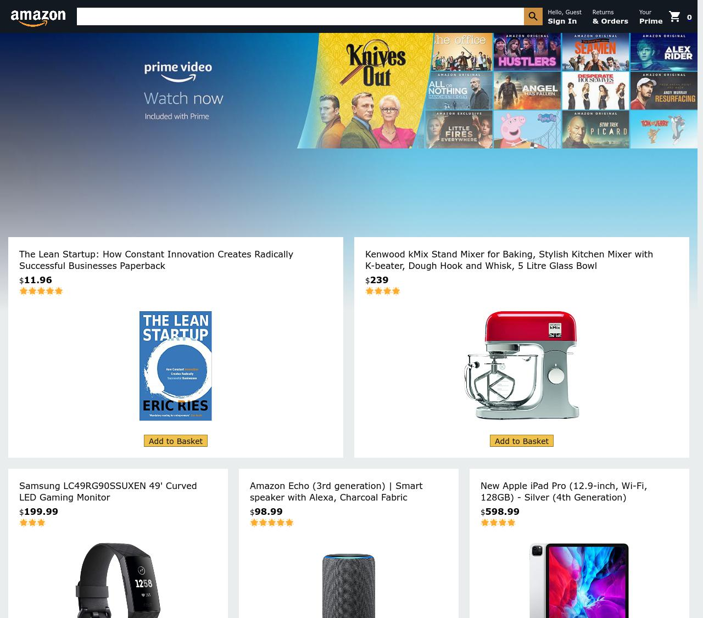

# amazon-clone

Clone of Amazon.com

## Visuals


## Installation
Clone or download this repository locally and then use the package manager [npm](https://nodejs.org) to install the [package.json](package.json)

```bash
npm i
```

## Authors and acknowledgment
- [Leon Xu](https://gitlab.com/leonxu260)

## License
For open source projects, say how it is licensed.
